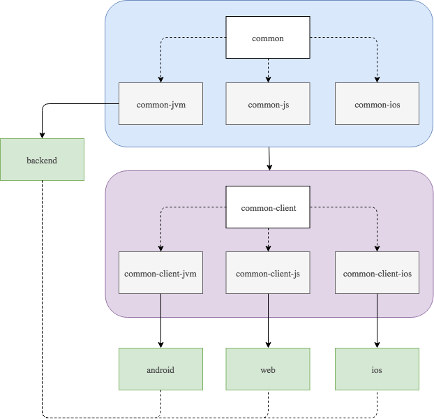

<h3 align="center">
  
</h3>

> This is a **Kotlin Multiplatform** starter template inspired by **Clean Architecture** and the
**MVP** pattern.

Currently we are using [IntellijIDEA](https://www.jetbrains.com/idea/) as the **main IDE**. However,
the **Android client** was developed in [Android Studio](https://developer.android.com/studio/)
and the **iOS client** with [Xcode](https://developer.apple.com/xcode/).

-------

    <a href="#architecture">Architecture</a> &bull;
    <a href="#backend">Backend</a> &bull;
    <a href="#web">Web</a> &bull;
    <a href="#android">Android</a> &bull;
    <a href="#ios">iOS</a>

-------

  

## Why?

This project started because we wanted to test the power of Kotlin Multiplatform. As opposed to
other cross-platform approaches, Kotlin **doesn't want you to write your code once** and **compile**
it to **multiple platforms**. Instead, it focus on **sharing** the part of the code that
contains **logic** and **left** the **platform specific** part to be implemented **natively**
using its **specific SDK's**.

Although this may look like a dream, Kotlin Multiplatform is still on the **early days** and we
quickly realised how difficult is to find concise documentation to setup and build such a project.

With this in mind, we decided to write this "easy" and small template that we think that might be
useful if you want to start a multiplatform project. Please **note** that this project will
**evolve** according to the **maturity** of the Kotlin multiplatform **support**, **tools** and
**libraries**. 🙂

## Architecture

The **architecture** of this project is composed by one **common module** and its **platform specific** implementations
(jvm, js and ios). A **common-client** module and the **platform specific** modules. One **backend** and three
**clients** (android, ios and web).

<h3 align="center">
  
</h3>

- **common**: Contains all the **common code** shared between the modules. In this case are only the **data** models.
- **common-jvm/js/ios**: Where the **common platform specific** implementations are placed.
- **common-client**: Where the **clients common** code is implemented. Such as the **business** and **presentation**
logic.
- **common-client-jvm/js/ios**: Responsible for the **common client specific** implementations.
- **backend**: Contains the **server** logic and a REST API.
- **android**: Responsible for the **android** clients. Contains a **mobile** module but you can add
others (e.g.: **wear**).
- **ios**: The **iOS** client!
- **web**: The **web client** that runs in the browser.

How everything is connected?

This project uses [Gradle](https://gradle.org/) that is responsible to **build** and **connect** all the modules.

The **common** module contains only the data models since it's the only code that we want to share between the
**backend** and the **client** modules.

But, what if this **common** module needs specific implementations for each platform? This's why we have the
**common-jvm**, **common-js** and **common-ios** platform modules. They are connected with the **common** module by an
**expectedBy** dependency and implement the **actual** classes that are **expected** in the **common** module
(e.g.: date, etc...).

The **common-client** module is responsible to implement the repositories, use cases and presenters. This is the code
that we want to share only between clients. And, again, if we want to implement platform specific parts
(e.g.: coroutines dispatcher, etc...) we have the **common-client-jvm**, **common-client-js** and **common-client-ios**
platform modules.

The other modules **(android, ios, and web)** use the **common-client** modules by **compiling** the platform specific
module. And, since we are using the MVP pattern, clients only need to implement the **View** part that is specific for
each platform.

Finally, the **backend** module is connected with the common code by **compiling** the **common-jvm** module.

<table>
<tr>
<td>
<i><b>Note:</b> This architecture was designed to work with both <b>backend</b> and <b>clients</b>. If you <b>only</b>
want to implement a <b>multiplatform</b> project with <b>clients</b> (probably the most common use case), you can
<b>merge</b> the <b>common</b> modules with the <b>common-client</b> modules. Moreover, don't forget to <b>remove</b>
the <b>platform</b> specific modules if you will not implement modules which use that <b>platform</b>.</i>
</td>
</tr>
</table>

## Backend

The backend is implemented using the [ktor](http://ktor.io/) framework.

To run it, simply execute `./gradlew :backend:run` in the root of the project and the server will 
start listening at [localhost:8080](http://localhost:8080).

You can test it by opening the [memes route](http://localhost:8080/memes) in your browser.

<table>
<tr>
<td>
<i>Since the server will run in your localhost, I suggest you to use <a href="https://ngrok.com/">ngrok</a> to
expose your local server to a public URL. <b>Don't forget to change the server host in the ApiUtils.kt.</b></i>
</td>
</tr>
</table>

## Android

<h3 align="center">
  
</h3>

If you are used to **Android Studio** you can open the project on it and run the **mobile** module.

Otherwise, use **gradle** to assemble the app: `./gradlew :android:mobile:assembleDebug`.

And install it via **adb**: `adb install android/mobile/build/outputs/apk/debug/mobile-debug.apk`.

## iOS

<h3 align="center">
  
</h3>

To run the iOS module you need to have the [Xcode](https://developer.apple.com/xcode/) and the
[CocoaPods](https://guides.cocoapods.org/) installed.

To install [CocoaPods](https://guides.cocoapods.org/) simply run: `sudo gem install cocoapods`.

Then, install the dependencies: `pod install`.

After that, double click on the **ios.xcworkspace** file to open the project.

Now, before running the project you also need to build the **common-client-ios** module:
`./gradlew :common-client-ios:build`.

Then, build the project by clicking in the **run** button. This will build and run the iOS project in an emulator.

## Web

<table>
<tr>
<td>
<i><b>Note:</b> Currently the web module is not working since we are waiting for <a href="http://ktor.io/">ktor</a> to
release the JS client.</i>
</td>
</tr>
</table>

<h3 align="center">
  
</h3>

To build the web client we use the [Kotlin Frontend Plugin](https://github.com/Kotlin/kotlin-frontend-plugin).

Currently, we are only using **Kotlin/JS** in order to manipulate the DOM. However, you can easily
use this plugin to write your UI in [React](https://reactjs.org/).

Run it with `./gradlew :web:run` and then open it on your [browser](http://localhost:8088).

## Credits

This project wouldn't be possible without the help of the community and other amazing open source
projects. Here are some really good examples that you can also look at:

- https://github.com/MarcinMoskala/KotlinAcademyApp
- https://github.com/ktorio/ktor-samples
- https://github.com/jetbrains/kotlinconf-app
- https://github.com/damboscolo/kotlin-native-multiplatform
- https://github.com/Albert-Gao/kotlin-native-mobile-multiplatform-example
- https://github.com/jetbrains/kotlinconf-spinner

## To Do

- Dependency Injection
- Tests
- JS Http Client ([ktor](http://ktor.io/) will publish a client soon...)
- Add a DB
- Share Images / Resources
- Improve gradle configurations
- More...

## License

    Copyright 2018 Pink Room, Lda.

    Licensed under the Apache License, Version 2.0 (the "License");
    you may not use this file except in compliance with the License.
    You may obtain a copy of the License at

       http://www.apache.org/licenses/LICENSE-2.0

    Unless required by applicable law or agreed to in writing, software
    distributed under the License is distributed on an "AS IS" BASIS,
    WITHOUT WARRANTIES OR CONDITIONS OF ANY KIND, either express or implied.
    See the License for the specific language governing permissions and
    limitations under the License.
