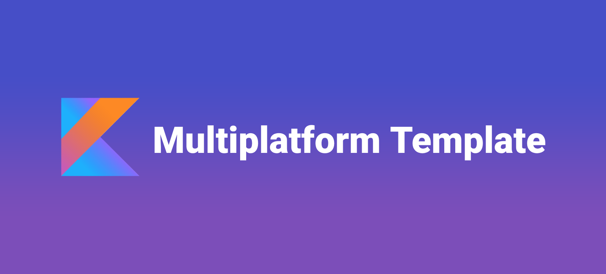
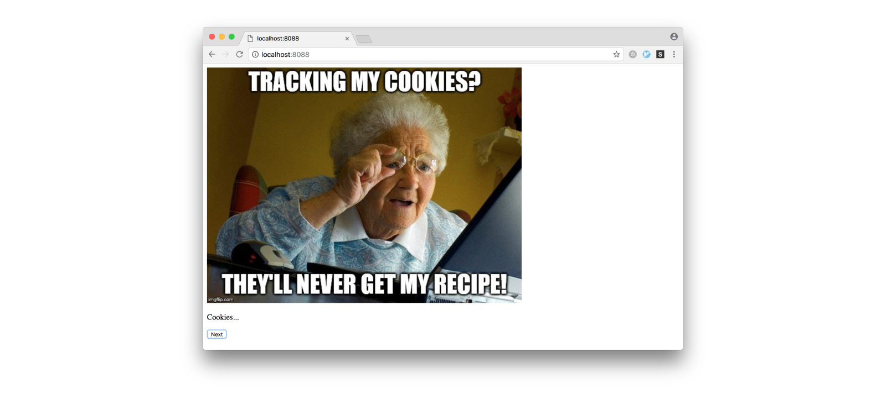
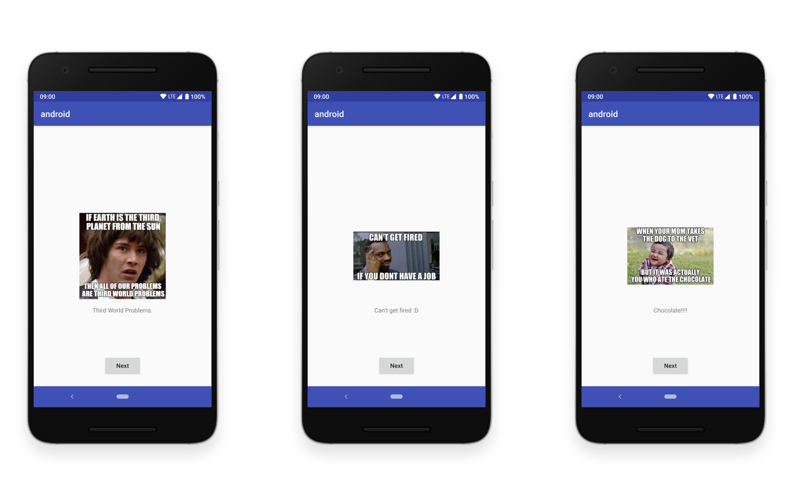

<h3 align="center">
  
</h3>

> This is a **Kotlin Multiplatform** starter template inspired by **Clean Architecture** and the
**MVP** pattern.

Currently we are using [IntellijIDEA](https://www.jetbrains.com/idea/) as the **main IDE**. However,
the **Android client** was developed in [Android Studio](https://developer.android.com/studio/)
and the **iOS client** with [Xcode](https://developer.apple.com/xcode/).

-------

    <a href="#architecture">Architecture</a> &bull;
    <a href="#backend">Backend</a> &bull;
    <a href="#web">Web</a> &bull;
    <a href="#android">Android</a> &bull;
    <a href="#ios">iOS</a>

-------

## Why?

This project started because we wanted to test the power of Kotlin Multiplatform. As opposed to
other cross-platform approaches, Kotlin **doesn't want you to write your code once** and **compile**
it to **multiple platforms**. Instead, it focus on **sharing** the part of the code that
contains **logic** and **left** the **platform specific** part to be implemented **natively**
using its **specific SDK's**.

Although this may look like a dream, Kotlin Multiplatform is still on the **early days** and we
quickly realised how difficult is to find concise documentation to setup and build such a project.

With this in mind, we decided to write this "easy" and small template that we think that might be
useful if you want to start a multiplatform project. Please **note** that this project will
**evolve** according to the **maturity** of the Kotlin multiplatform **support**, **tools** and
**libraries**. 🙂

## Architecture

The architecture of this project is composed by 8 different modules:

- **common**: Contains all the **common code** shared between the modules. Such as the
**data**, **business** and **presentation** logic.
- **common-jvm**: Where the **JVM** specific implementations are placed.
- **common-js**: Contains the specific implementations for the **JS** platforms.
- **common-ios**: This is responsible for the **native** specific implementations. 
- **backend**: Contains the **server** logic and a REST API.
- **web**: The **web client** that runs in the browser.
- **android**: Responsible for the **android** clients. Contains a **mobile** module but you can add
others (e.g.: **wear**).
- **ios**: The **iOS** client!

But how do they connect with each other?

The **common** module contains the data models, repositories, use cases and presenters that will be
shared with the other modules.

And if we need specific implementations for each platform? This's why we have the **common-jvm**,
**common-js** and **common-ios** platform modules. They are connect to the **common** module by an
**expectedBy** dependency and implement the **actual** classes that are **expected** in the
**common** module (e.g.: date, http requests...).

The other modules **(backend, web, android and ios)** use the **common** modules by **compiling**
the platform specific module. And, since we are using the MVP pattern, clients only need to
implement the **View** part that is specific for each platform.

<table>
<tr>
<td>
<i><b>Note:</b> The <b>backend</b> module is just here as an example. In a real project, if you want
to share code between the clients and the backend (probably only the data part), you should only
have that classes in the <b>common</b> module and create a new module called <b>common-client</b>
that will contain the <b>repositories</b>, <b>use cases</b> and <b>presenters</b>. This way, the 
<b>backend</b> module only needs to compile the <b>common</b> module instead of all the code in the
<b>common-client</b>.</i>
</td>
</tr>
</table>

## Backend

The backend is implemented using the [ktor](http://ktor.io/) framework.

To run it, simply execute `./gradlew :backend:run` in the root of the project and the server will 
start listening at [localhost:8080](http://localhost:8080).

## Web

<h3 align="center">
  
</h3>

To build the web client we use the [Kotlin Frontend Plugin](https://github.com/Kotlin/kotlin-frontend-plugin).

Currently, we are only using **Kotlin/JS** in order to manipulate the DOM. However, you can easily
use this plugin to write your UI in [React](https://reactjs.org/).

Run it with `./gradlew :web:run` and then open it on your [browser](http://localhost:8088).

## Android

<h3 align="center">
  
</h3>

If you are used to **Android Studio** you can open the project on it and run the **mobile** module.

Otherwise, use **gradle** to assemble the app: `./gradlew :android:mobile:assembleDebug`.

And install it via **adb**: `adb install android/mobile/build/outputs/apk/debug/mobile-debug.apk`.

## iOS

<h3 align="center">
  
</h3>

To run the iOS module you need to have the [Xcode](https://developer.apple.com/xcode/) and the
[CocoaPods](https://guides.cocoapods.org/) installed.

To install [CocoaPods](https://guides.cocoapods.org/) simply run: `sudo gem install cocoapods`.

Then, install the dependencies: `pod install`.

After that, double click on the **ios.xcworkspace** file to open the project.

Now, build the project by clicking in the **run** button. This will build and run the iOS project
in an emulator. If you have any error please build the **Common** module first and then run the
**ios** module again.

## Credits

This project wouldn't be possible without the help of the community and other amazing open source
projects. Here are some really good examples that you can also look at:

- https://github.com/MarcinMoskala/KotlinAcademyApp
- https://github.com/jetbrains/kotlinconf-app
- https://github.com/damboscolo/kotlin-native-multiplatform
- https://github.com/Albert-Gao/kotlin-native-mobile-multiplatform-example
- https://github.com/jetbrains/kotlinconf-spinner

## To Do

- Dependency Injection
- Tests
- Multiplatform Http Requests ([ktor](http://ktor.io/) will publish a client soon...)
- Add a DB
- Share Images / Resources
- More...

## License

    Copyright 2018 Pink Room, Lda.

    Licensed under the Apache License, Version 2.0 (the "License");
    you may not use this file except in compliance with the License.
    You may obtain a copy of the License at

       http://www.apache.org/licenses/LICENSE-2.0

    Unless required by applicable law or agreed to in writing, software
    distributed under the License is distributed on an "AS IS" BASIS,
    WITHOUT WARRANTIES OR CONDITIONS OF ANY KIND, either express or implied.
    See the License for the specific language governing permissions and
    limitations under the License.
